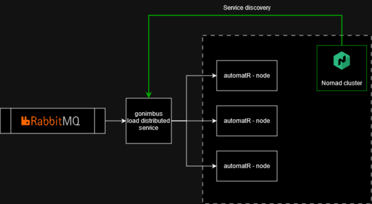

# Gonimbus

A load distribution service for my automatR worker node written in Golang.

Why not using traefik as a load balancer instead ? 
I want to learn load balancing algorithm and function behind a load balancer in order to implement to my Api Gateway - (Golucid) in the future.  

## Goals 

- Integrate with Nomad's service discovery 
- Distribute work to multiple nodes which deploy on Nomad cluster.  